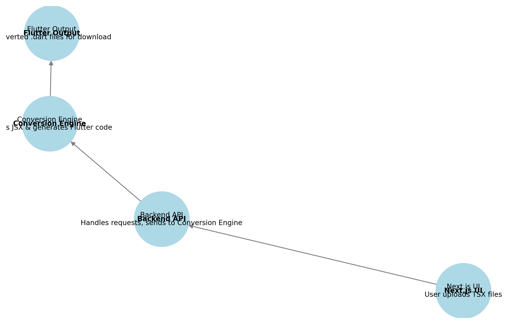

# 🏗️ System Design

## 🔹 System Architecture

This project follows a structured pipeline to convert Next.js TSX components into Flutter Dart widgets.

### 📌 System Flow Diagram


## 🔹 Components Breakdown

1️⃣ **Next.js UI**  
   - Users upload TSX files.  
   - Displays the converted Dart code.  

2️⃣ **Backend API (Node.js/Python)**  
   - Handles requests and sends TSX files to the Conversion Engine.  
   - Provides the converted Flutter code as a downloadable file.  

3️⃣ **Conversion Engine**  
   - Parses JSX/TSX using Babel (Node.js) or AST (Python).  
   - Maps React components to Flutter widgets.  
   - Converts styles and event handlers.  

4️⃣ **Flutter Output**  
   - Generates `.dart` files.  
   - Downloads the converted Flutter UI files.  

## 🔹 Folder Structure

```
/nextjs-to-flutter
│── frontend/        # Next.js UI (User Interface)
│── backend/         # Node.js API to handle requests
│── conversion/      # JSX → Dart Engine (Parsing & Mapping)
│── docs/            # Documentation and diagrams
│── scripts/         # Helper scripts for automation
│── tests/           # Unit tests for conversion validation
```

## 🔹 Responsibilities

| Component        | Technology | Role |
|-----------------|------------|------|
| Next.js UI | Next.js (TSX) | User Interface & File Upload |
| Backend API | Node.js (Express) | Handles requests, sends data to the Conversion Engine |
| Conversion Engine | Babel AST (Node) / Python AST | Parses TSX and generates Flutter code |
| Storage & Hosting | Firebase / Google Cloud | Stores conversion history and hosts API |
